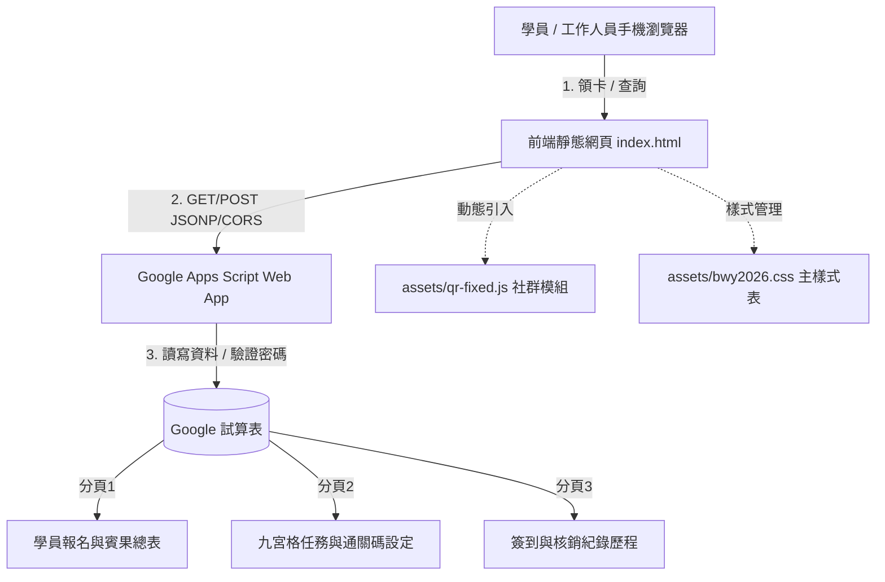

[2025福青蔬食月開發歷程](2025.md)

# 2026 清大福青・蔬食月九宮格賓果挑戰系統

國立清華大學福智青年社（NTHU BWY）2026 蔬食月「集食行善」數位化活動管理與九宮格賓果集點系統。

本專案將傳統紙本集點卡全面數位化，結合 Google 雲端試算表（Google Sheets）與 Google Apps Script（GAS）無伺服器架構，學員無須安裝任何 App 即可透過手機瀏覽器報名、領取專屬數位賓果卡、輸入通關碼蓋章，並享有工作人員綠色通道免密核銷、連線即時試算及防作弊安全機制。

---

## 一、 系統特色

| 功能模組 | 特色說明 |
|---|---|
| **專屬數位卡片** | 報名即配發 6 位專屬流水號（例如 `VEG-2026-274154`），關閉網頁後可隨時憑流水號重新載入進度 |
| **九宮格與連線判定** | 3×3 互動式方格，自動即時演算 8 種連線組合（橫 3、直 3、斜 2），達成連線時自動觸發高亮動效與獎勵提示 |
| **雙軌核驗蓋章** | 支援「官方通關代碼核銷」與「工作人員綠色通道免密核銷」，滿足自主打卡與現場攤位快速通關需求 |
| **動態任務雲端同步** | 前端九宮格任務名稱、條件與通關密碼完全依據 Google 試算表即時讀取，主辦方調整試算表即全網生效 |
| **安全防護架構** | 工作人員通行密碼改由後端驗證，公開 API 絕不外洩密碼；具備格子範圍校驗（0~8）與重複蓋章冪等防護 |
| **自適應社群二維碼** | 桌機大螢幕自動於留白處展示常駐側欄；平板與手機螢幕自動收納為右下角 FAB 浮動按鈕與彈窗，零遮擋操作 |

---

## 二、 系統架構



---

## 三、 檔案目錄結構

```text
NTHU_BWY_veggie/
├── index.html                       # 2026 蔬食月賓果挑戰主頁面
├── qr-fixed.html                    # 社群二維碼模組獨立預覽頁
├── 2025.html                        # 2025 歷史特蔬任務頁面
├── tree.html                        # 寫下承諾互動頁面
├── dashboard.html                   # 統計圖表儀表板
├── Google_Apps_Script_設定教學.md    # 後端 Apps Script v6 程式碼與安裝手冊
├── 2025.md                          # 2025 福青蔬食月初始開發歷程文檔
├── README.md                        # 本專案說明文件
├── assets/
│   ├── GoogleAppsScript.js          # 前端核心資料邏輯與 Web App 串接設定
│   ├── bwy2026.css                  # 賓果挑戰主要視覺與動畫樣式
│   ├── qr-fixed.js                  # 社群二維碼自適應按鈕與彈窗獨立模組
│   ├── dashboard.js                 # 儀表板圖表邏輯
│   └── style.css                    # 通用排版基礎樣式
└── img/                             # 圖檔目錄（二維碼、印章、社群標誌等）
```

---

## 四、 快速部署指南

### 1. 後端設定（Google 試算表與 Apps Script）
1. 建立一份新的 Google 試算表，命名為 `2026蔬食週_賓果資料庫`。
2. 建立三個工作表分頁：
   * `學員報名與賓果總表`
   * `九宮格任務與通關碼設定`
   * `簽到與核銷紀錄歷程`
3. 點選試算表功能表的「擴充功能」>「Apps Script」。
4. 將本專案中 `Google_Apps_Script_設定教學.md` 提供的最新後端程式碼完整貼入 `程式碼.gs`。
5. 點選右上角「部署」>「新增部署作業」：
   * 種類：**網頁應用程式（Web App）**
   * 執行身分：**我**
   * 誰可以存取：**所有人（任何人）**
6. 複製取得的 Web App URL（結尾為 `/exec`）。

### 2. 前端設定
1. 開啟 `assets/GoogleAppsScript.js`，將第 3 行的常數替換為您部署的 Web App URL：
   ```javascript
   const GOOGLE_APPS_SCRIPT_URL = "https://script.google.com/macros/s/你的部署ID/exec";
   ```
2. 將所有網頁檔案上傳至 GitHub Pages、XAMPP 或任何靜態網頁伺服器，即可開始使用。

---

## 五、 試算表分頁欄位規範

### 分頁一：學員報名與賓果總表
| 欄位 A | 欄位 B | 欄位 C | 欄位 D | 欄位 E | 欄位 F ~ N | 欄位 O | 欄位 P | 欄位 Q |
|---|---|---|---|---|---|---|---|---|
| 流水號 | 報名時間戳記 | 姓名 | 系級與學號 | 聯絡方式 | 格 1 ~ 9 狀態（0 或 1） | 達成連線數 | 兌獎狀態 | 最後更新時間 |

### 分頁二：九宮格任務與通關碼設定
| 欄位 A（格子編號） | 欄位 B（任務標題） | 欄位 C（任務說明） | 欄位 D（官方通關代碼） |
|:---:|---|---|:---:|
| 0 | 工作人員綠色通道 | 提供社團工作人員免密碼快速蓋章 | `nthu.bwy2026`（自訂密碼） |
| 1 | 環保杯與餐具 | 使用環保杯或環保餐具購買飲料或餐點一次 | `ECO2026` |
| 2 | 看靜態展+許願樹 | 看靜態展+許願樹（現場驗證） | `TREE2026` |
| 3 | IG 分享靜態展 | 在 IG 限動分享靜態展並標註社團 | `IGEXPO2026` |
| 4 | 運動會擺攤 | 參加 11/11 運動會擺攤（現場驗證） | `SPORT1111` |
| 5 | 吃一餐蔬食餐 | 吃一餐蔬食餐（核心任務） | `VEG2026` |
| 6 | IG 分享料理實作 | 在 IG 限動分享料理實作並標註社團 | `IGCOOK2026` |
| 7 | 帶好友同行 | 帶一位朋友參加蔬食月活動（兩人皆可蓋） | `FRIEND2026` |
| 8 | 料理實作 | 參加 11/18 料理實作（現場驗證） | `COOK1118` |
| 9 | 主題社課（擇一） | 參加前行社課或總結社課（現場驗證） | `CLASS2026` |

---

## 六、 授權與維護

* 主辦單位：國立清華大學福智青年社（NTHU Bliss & Wisdom Youth Club）
* 專案維護：清大福青社行政與資訊團隊
* 授權條款：MIT License
